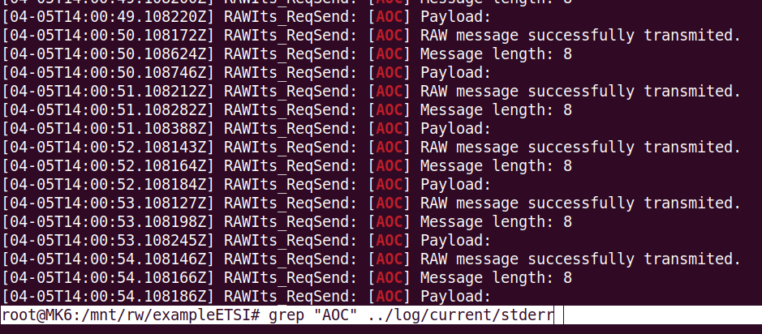
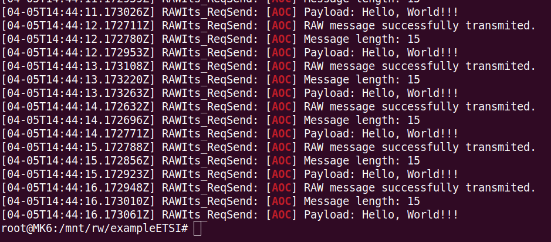
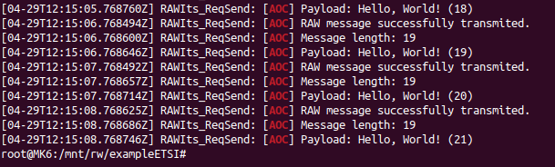

# Hello, World !

This is a tutorial on how to send custom messages with the Mk6 device.

## Requirements

To follow this tutorial you need to:

- Install Cohda's SDK. [(Instructions)](https://support.cohdawireless.com/hc/en-us/articles/202668864-Installing-and-configuring-the-MKx-SDK)
- Be able to connect to the Mk6 device through SSH. [(Instructions)](https://support.cohdawireless.com/hc/en-us/articles/360001707775-Connect-MKx-via-Ethernet)
- Install and Run ExampleETSI at least once. [(Instructions)](https://support.cohdawireless.com/hc/en-us/articles/360001755856-ExampleETSI-Installing-Running)

## Overview

We will modify ExampleETSI to build a Hello World application.
1. Enable transmission of RAW messages.
2. Modify standard RAW message.
3. Create a custom RAW message.
4. Handle RAW message reception.

## Logging RAW messages transmission

First, let's add some log messages whenever a RAW message is sent so we can see what we are doing. In `raw-its.c`, go the function:

```c
/**
 * @brief RAW Packet Sending with UPER-encoded data
 * @param Handle Handle from ETSI MSG API
 * @param pParams Pointer to parameters of control and data
 *
 */
static int RAWIts_ReqSend(tETSIMSGHandleCode Handle,
                          tRAWItsParams *pParams){
.
.
.
}
```
At the end of this function, whenever a RAW message is successfully transmited, we will log a message:

```c
    if (Stat == ETSIMSG_SUCCESS)
    {
        d_printf(D_DEBUG, 0 , "[AOC] RAW message successfully transmited.");
        d_printf(D_DEBUG, 0 , "[AOC] Message length: %d \n", (int) pParams->DataLength);
	      d_printf(D_DEBUG, 0 , "[AOC] Payload: %s \n", (char *) pParams->Data);
        Ret = 0;
    }
```

Once this is done, build this exampleETSI and send the new tarball to an Mk6 device.

## Configuring exampleETSI to send RAW messages and log

Go to `/mnt/rw/exampleETSI/` and copy the following from `raw.cfg`:

```
  RAWIts = {
    // Enable/Disable switch for the entire module
    Enable = true;
    # BTP Port to open
    BTPPort = 3000;

    # Transmit period [ms]
    TxInterval  = 1000;
    # Receive interval
    RxInterval  = 1000;

    # Raw packet to send
    Packet = {
      DestInfo      = 0x0000; # Info = 0
      PktTransport  = 7; # 2=GUC, 4=GBC, 7=SHB
      Location      = 0x1ef9004444123456L; # only for GUC
      AreaLat       = -340000000; # only for GBC
      AreaLong      = 1380000000; # only for GBC
      AreaDistA     = 100; # only for GBC
      AreaDistB     = 0; # only for GBC
      AreaAngle     = 0; # only for GBC
      AreaShape     = 0; # only for GBC, 0=circle, 1=rect, 2=ellipse
      CommProfile   = 0; # Use default
      TrafficClass  = 0x03; # DP3, no SCF
      MaxPktLifetime = 0; # Use default
      SecProfile    = 3; # 0=None, 1=Custom, 2=CAM, 3=General

      Data = [ 0x00, 0x11, 0x22, 0x33, 0x44, 0x55, 0x66, 0x77 ];
    };
  };
```

Observe the struct of the file `raw.cfg` and paste the above text accordingly at `obu.cfg`. This will enable the application to send RAW messages in OBU mode.

Now, open `obu.conf` and change the Cohda_DebugLevel to 7 so we can see our logs.

Finally run the exampleETSI:

```bash
root@MK6:/mnt/rw/exampleETSI/ ./rc.exampleETSI start obu
```

>[!NOTE]
>In the future, it is easier to edit these config files before sending them to the Mk6 devices.

## Checking our logs

Use the following command to verify if our messages appear in the log file:

```bash
root@MK6:/mnt/rw/exampleETSI/ grep "AOC" ../log/current/stderr
```

You should see something like this:



We can successfully transmit data but we are transmitting only 8 bytes containing `Data = [ 0x00, 0x11, 0x22, 0x33, 0x44, 0x55, 0x66, 0x77 ]` defined our `obu.cfg`. This is why we don't see the message payload on our log.

## Modify standard RAW message to Hello World

Stop the application and change `obu.cfg` such that:

```c
    Data = [0x48, 0x65, 0x6c, 0x6c, 0x6f, 0x2c, 0x20, 0x57, 0x6f, 0x72, 0x6c, 0x64, 0x21, 0x21, 0x21];
```

Now you should have the following log:



We have a hello world! Hopefully, you can guess what those hexadecimal values above mean. However, we want to create massages on the fly instead of having a pre-defined standard message. To do so, we need to modify the `raw_its.c` file and create our own RAW messages.


## Customize RAW messages in `raw_its.c`

In the function `static void RAWIts_ThreadProc (void *pArg)`, there is a loop that sends the standard RAW message every few seconds:

```c
  if (RAWHandle < ETSIMSG_SUCCESS)
  {
    d_error(D_ERR, 0, "Unable to open BTP port %d\n", pRAW->Params.BTPPort);
    goto Error;
  }

  // Thread loop
  while ((pRAW->ThreadState & RAWITS_THREAD_STATE_STOP) == 0)
  {
    // sleeping delay
    Util_Nap(pRAW->Params.TxInterval, &Time);

    // Send something
    RAWIts_ReqSend(RAWHandle, &pRAW->Params);
  }
```

We can write whatever we want in `pRAW->Params.Data` before the message request. For example, do the following:

```c
  // Open BTP Port
  // No handler provided, use EXT interface to get MSG Indications
  RAWHandle = ETSIMSG_OpenInterface(pRAW->Params.BTPPort, NULL);

  if (RAWHandle < ETSIMSG_SUCCESS)
  {
    d_error(D_ERR, 0, "Unable to open BTP port %d\n", pRAW->Params.BTPPort);
    goto Error;
  }

  // AOC: Hello, World!
  int hello_count = 0;
  char hello_data[RAWITS_DATA_BUF_SIZE];
  size_t hello_length = 0;
  // --------------------------------
  // Thread loop
  while ((pRAW->ThreadState & RAWITS_THREAD_STATE_STOP) == 0)
  {
    // AOC: Hello, World!
    snprintf(hello_data, RAWITS_DATA_BUF_SIZE, "Hello, World! (%d)", hello_count);
    hello_count++;

    hello_length = strlen(hello_data) + 1;
    if (hello_length <= RAWITS_DATA_BUF_SIZE) {
      memcpy(pRAW->Params.Data, hello_data, hello_length);
      pRAW->Params.DataLength = hello_length;
    }
    // --------------------------------
    // sleeping delay
    Util_Nap(pRAW->Params.TxInterval, &Time);

    // Send something
    RAWIts_ReqSend(RAWHandle, &pRAW->Params);
  }
```

Now, create the tarball, launch exampleETSI as an obu on the Mk6 device and observe the log. You should see the following:



## Handle RAW message reception

Finally, we need to handle messages recption. Our goal is to have an OBU sending our custom hello world and an RSU that receives and logs these messages.

The function `static void RAWIts_ExtCallback(tExtEventId Event, tExtMessage *pMsg, void *pPriv)` treats RAW message reception. After decoding its contents with `asn1_uper_decode(void **pdata, const ASN1CType *p, const uint8_t *buf, size_t buf_len, ASN1Error *err)`, we can access the payload:


```c
      int Bytes = asn1_uper_decode((void **)&pRawRx, asn1_type_RAW_DUMMYPDU, (const uint8_t *)pPayload, Length, &Err);

      if (Bytes <= 0)
      {
        d_printf(D_WARN, NULL, "UPER decode failed: %d (bit %d, %s)\n", Bytes, Err.bit_pos, Err.msg);
        d_printf(D_DEBUG, NULL, "[AOC] UPER decode failed: %d (bit %d, %s)\n", Bytes, Err.bit_pos, Err.msg);
      }
      else
      {
        // Access some parts of the structure
        d_printf(D_INFO, NULL, "StationID=0x%04x, Seq %d\n",
                 (int)pRawRx->header.stationID,
                 (int)pRawRx->dummy.sequenceNumber);
        d_printf(D_DEBUG, NULL, "[AOC] Raw message from StationID=0x%04x, Seq %d, MSG: %s\n",
                 (int)pRawRx->header.stationID,
                 (int)pRawRx->dummy.sequenceNumber,
                 (char *)pRawRx->dummy.someData.buf);

        // Use the GSER encoder to show the message in the debug output
        uint8_t *pGSerBuf;
        unsigned int GSerLen;

        GSerLen = asn1_gser_encode(&pGSerBuf, asn1_type_RAW_DUMMYPDU, pRawRx);

        d_printf(D_INFO, NULL, "GSER[%d]:\n%s", GSerLen, pGSerBuf);
        free(pGSerBuf);
      }

```
